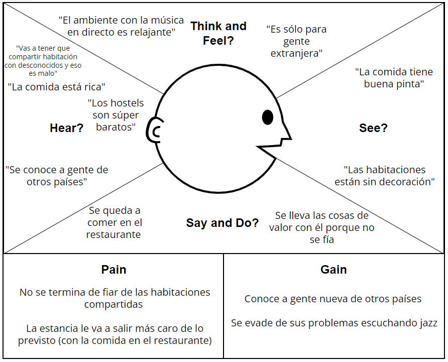
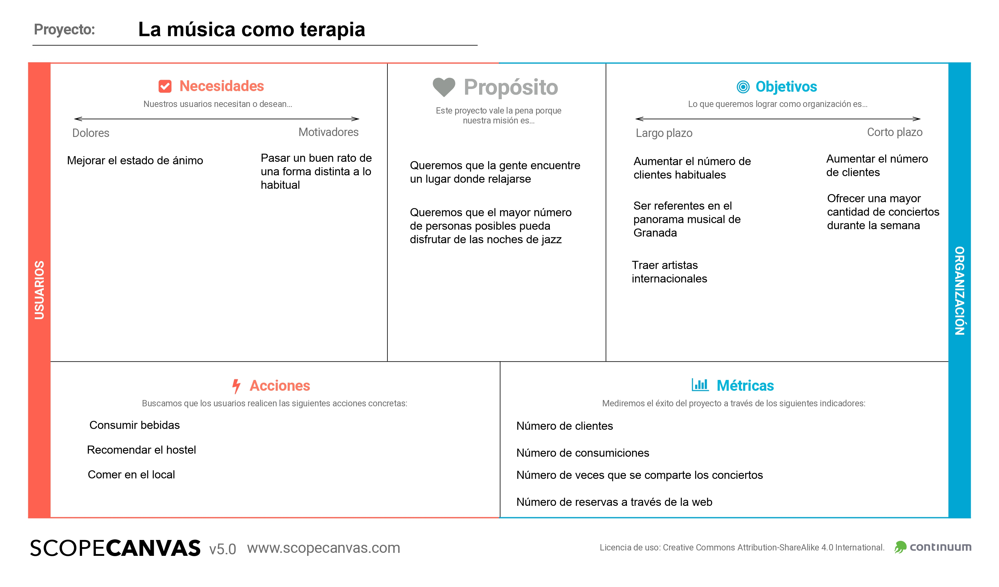
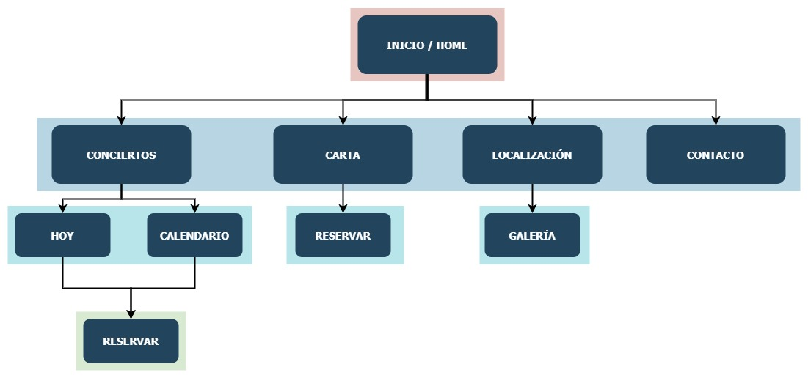

## DIU - Practica2, entregables

### Ideación 

#### Mapa de empatía

### PROPUESTA DE VALOR

#### ScopeCanvas

### TASK ANALYSIS
Hemos decidido realizar el User Task Matrix para tener una visión más clara de la importancia de cada una de las funcionalidades para saber cuáles priorizar en la interfaz.
#### User Task Matrix 
| Tareas | **Grupo de amigos** | **Artista** | **Amante de la música**|
| --- | --- | --- | --- | 
| **Ver carta**| H | L | M |
| **Programación conciertos**| M | H | H |
| **Reservar mesa**| H | L | M |
| **Localización**| H | H | H |
| **Contactar con el negocio**| L | H | M |

### ARQUITECTURA DE INFORMACIÓN

#### Site Map

#### Labelling 

| **Etiqueta** | **Descripción** | **Icono** |
| --- | --- | --- |
| **Inicio**| Página inicial donde se muestra una descripción breve del lugar y los conciertos |  |
| **Conciertos**| Página donde se ofrece información sobre los tipos de conciertos que se pueden encontrar en el hostel |  |
| **Hoy**| Página donde se ofrece información sobre qué concierto tiene lugar en la fecha actual | |
| **Calendario**| Página donde se ofrece información sobre los conciertos fijados durante ese mes |  |
| **Reservar**| Página con un formulario para realizar la reserva de una mesa | |
| **Carta**| Página donde se muestra el menú que ofrece el restaurante |  |
| **Localización**| Página donde se muestra la ubicación del hostel y cómo llegar hasta él |  |
| **Galería**| Página donde se muestra un conjunto de imágenes del bar donde tienen lugar los conciertos |  |
| **Contacto**| Página con un formulario para contactar con el personal del hostel |  |

### Prototipo Lo-FI Wireframe 

### Conclusiones  
(incluye valoración de esta etapa)
