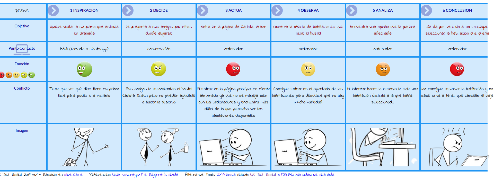
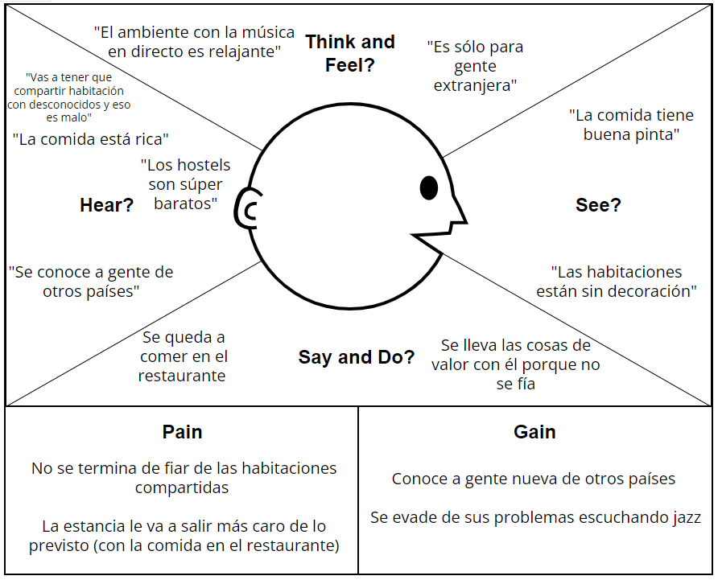
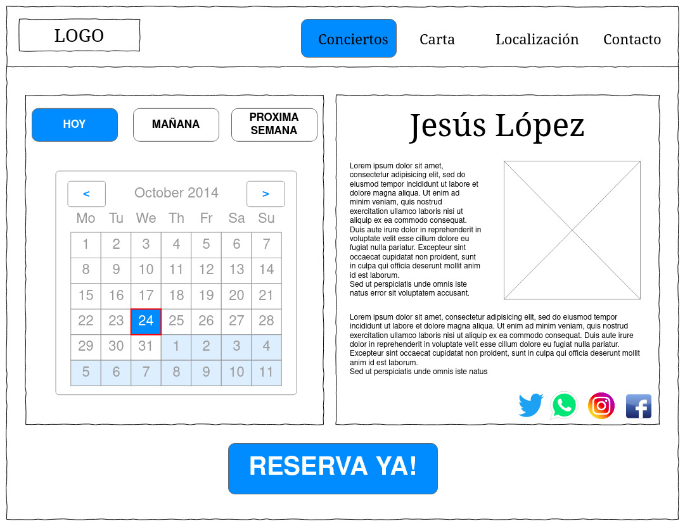
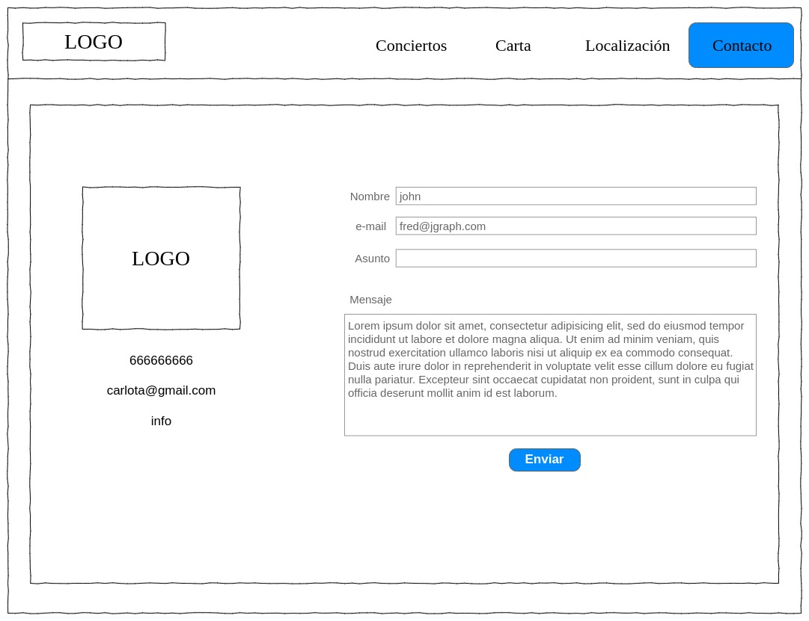

# DIU22
Prácticas Diseño Interfaces de Usuario 2021-22 (Tema: Hostels) 

Grupo:  DIU2.Unknown  Curso: 2021/22 
Updated: 11/2/2022

Proyecto: 
**La música como terapia**

Descripción: 

La idea de nuestro microsite es potenciar la música en directo que se ofrece en el hostal, proponiendo un lugar en el que la música sirva como desconexión a los problemas del día a día. Esto servirá para captar la atención de los amantes de la música y de los artistas que se quieran dar a conocer.

Logotipo: 

Miembros
 * :bust_in_silhouette:  Jesús López Pujazón     :octocat:     
 * :bust_in_silhouette:  Lucía Salamanca López     :octocat:

----- 

# Proceso de Diseño 

## Paso 1. UX Desk Research & Analisis 

 1.a Competitive Analysis
-----

| **Característica**| **Carlota Braun** | **TocHostels** | **CasaBarceló**|
| --- | --- | --- | --- | 
| **Selección de idioma**| Dispone de una opción para traducir mediante el traductor de google (en ocasiones dando lugar a traducciones más inexactas). |Ofrece una opción para cambiar de idioma a inglés y coreano. | Únicamente está disponible en español e inglés.|
| **Localización**| Al acceder al apartado _Donde estamos_ aparecen lugares próximos pero no la localización exacta, teniendo que bajar hasta el final de la página para verla. |No hay un apartado de localización, aunque si descendemos en la página principal encontramos todas las ubicaciones exactas.|Al acceder al apartado _Ubicación_ encontramos la dirección exacta del establecimiento y direcciones para llegar.|
| **Página principal**| El diseño de la página principal es atractivo pero poco legible debido al poco contraste entre la tipografía y la imagen del fondo. |La página principal es elegante y minimalista ofreciendo la información más relevante al bajar por la página.|El diseño es menos atractivo que el de las otras dos páginas ofreciendo menos información que en los casos previos.|
| **Diseño de la interfaz**| Atractiva, sin embargo, tiene varios errores como el comentado anteriormente y faltas de ortografía. | Interfaz atractiva y muy intuitiva.|Poco atractiva y a veces resulta poco intuitiva debido a las posiciones donde se encuentran distintas funcionalidades.|
| **Información acerca de las instalaciones**| Ofrece un resumen de los servicios que disponen y fotografías de las habitaciones. |Ofrece fotografías y un resumen detallado de todos los servicios que ofrecen.|Sólo ofrece una galería de fotografías pero no señala los distintos servicios de los que dispone el hotel y, en concreto, las habitaciones.|

 1.b Persona
-----

Hemos elegido dos personas que pueden ser clientes potenciales de un hostel. Una de ellas con más experiencia en el uso de la tecnología y otra con menos experiencia. 

 1.c User Journey Map
----

Pensamos que estas dos experiencias de usuarios pueden ser las habituales conforme a la personalidad dotada en la creación de ambas personas.

 1.d Usability Review
----

Tanto el xls como el pdf se encuentran en la carpeta P1.

La valoración final es de 61. Los usuarios son capaces de navegar por la página y realizar las tareas que necesiten. Sin embargo, la interfaz puede ser mejorada en muchos aspectos para que la experiencia de usuario sea más satisfactoria.

## Paso 2. UX Design  

 2.a Feedback Capture Grid / Empathy map / POV
----

#### Mapa de empatía 

| Interesante | Críticas | 
| ------------- | -------
|  Diseño de la págia atractivo | Es difícil encontrar el apartado de conciertos |
| | Es difícil encontrar la localización |
  
  
Nuestra propuesta de valor está enfocada en la música en directo que ofrece el hostel, buscando así que sea reconocido por sus conciertos y no sólo por el alojamiento. De este modo organizaremos y estructuraremos mejor todo lo relacionado con los conciertos para poder acceder fácilmente a la información y poder realizar reservas de mesas de manera más sencilla. 

Hemos decidido esta propuesta de valor ya que consideramos que no se aprovecha el potencial de los conciertos para atraer a nuevos clientes. Además, queremos atraer a clientes jóvenes a través del uso de las redes sociales.

 2.b ScopeCanvas
----

 2.b Tasks analysis 
-----

Hemos decidido realizar el User Task Matrix para tener una visión más clara de la importancia de cada una de las funcionalidades para saber cuáles priorizar en la interfaz.
#### User Task Matrix 
| Tareas | **Grupo de amigos** | **Artista** | **Amante de la música**| **Extranjero** |
| --- | --- | --- | --- | --- |
| **Ver carta**| H | L | M | H |
| **Programación conciertos**| M | H | H | L |
| **Reservar mesa**| H | L | M | H |
| **Localización**| H | H | H | H |
| **Contactar con el negocio**| L | H | M | L |

 2.c IA: Sitemap + Labelling 
----

#### Site Map

#### Labelling 

| **Etiqueta** | **Descripción** | **Icono** |
| --- | --- | --- |
| **Inicio**| Página inicial donde se muestra una descripción breve del lugar y los conciertos |  |
| **Conciertos**| Página donde se ofrece información sobre los tipos de conciertos que se pueden encontrar en el hostel. Además se ofrece la posibilidad de compartir la información del concierto a través de las redes sociales.|  |
| **Hoy**| Página donde se ofrece información sobre qué concierto tiene lugar en la fecha actual | |
| **Calendario**| Página donde se ofrece información sobre los conciertos fijados durante ese mes |  |
| **Reservar**| Página con un formulario para realizar la reserva de una mesa | |
| **Carta**| Página donde se muestra el menú que ofrece el restaurante |  |
| **Localización**| Página donde se muestra la ubicación del hostel y cómo llegar hasta él |  |
| **Galería**| Página donde se muestra un conjunto de imágenes del bar donde tienen lugar los conciertos |  |
| **Contacto**| Página con un formulario para contactar con el personal del hostel |  |

 2.d Wireframes
-----

#### Página de Inicio

#### Página de Conciertos

#### Página de Carta

#### Página de Localización

#### Página de Contacto

#### Página de Reserva

## Paso 3. Mi UX-Case Study (diseño)

 3.a Moodboard
-----

[Moodboard en milanote](https://app.milanote.com/1NOqwR1w3mQ5eH?p=uetX8nklt0Q)

Para la paleta de colores hemos decidido escoger cinco colores basados en las imágenes que nos han servido de inspiración. Estos colores son: 
* **Dark Red**: #92140C
* **Smoky Black**: #0F0F0F
* **Satin Sheen Gold**: #C89933
* **White**: #FBFBFB
* **Xanadu**: #77867F

Debido a la elegancia del jazz hemos decidido elegir el blanco, el negro y el gris. Esta elegancia también está presente en las imágenes en blanco y negro de la época.
El rojo representa la pasión intrínseca en la propia esencia de la música en sí y el dorado simboliza los instrumentos de viento metal tan característicos en esta música.

  3.b Landing Page
----

[LandingPage Protopie](https://cloud.protopie.io/p/c3ace80ef5?touchHint=true&ui=true&scaleToFit=true&cursorType=touch&mockup=true&bgColor=%23F5F5F5&playSpeed=1&playerAppPopup=true)

>>> Plantear Landing Page 

 3.c Guidelines
----

>>> Estudio de Guidelines y Patrones IU a usar 
>>> Tras documentarse, muestre las deciones tomadas sobre Patrones IU a usar para la fase siguiente de prototipado. 

  3.d Mockup
----

>>> Layout: Mockup / prototipo HTML  (que permita simular tareas con estilo de IU seleccionado)

 3.e ¿My UX-Case Study?
-----

>>> Publicar my Case Study en Github..
>>> Documente y resuma el diseño de su producto en forma de video de 90 segundos aprox

## Paso 4. Evaluación 

 4.a Caso asignado
----

>>> Breve descripción del caso asignado con enlace a  su repositorio Github

 4.b User Testing
----

>>> Seleccione 4 personas ficticias. Exprese las ideas de posibles situaciones conflictivas de esa persona en las propuestas evaluadas. Asigne dos a Caso A y 2 al caso B
 

| Usuarios | Sexo/Edad     | Ocupación   |  Exp.TIC    | Personalidad | Plataforma | TestA/B
| ------------- | -------- | ----------- | ----------- | -----------  | ---------- | ----
| User1's name  | H / 18   | Estudiante  | Media       | Introvertido | Web.       | A 
| User2's name  | H / 18   | Estudiante  | Media       | Timido       | Web        | A 
| User3's name  | M / 35   | Abogado     | Baja        | Emocional    | móvil      | B 
| User4's name  | H / 18   | Estudiante  | Media       | Racional     | Web        | B 

. 4.c Cuestionario SUS
----

>>> Usaremos el **Cuestionario SUS** para valorar la satisfacción de cada usuario con el diseño (A/B) realizado. Para ello usamos la [hoja de cálculo](https://github.com/mgea/DIU19/blob/master/Cuestionario%20SUS%20DIU.xlsx) para calcular resultados sigiendo las pautas para usar la escala SUS e interpretar los resultados
http://usabilitygeek.com/how-to-use-the-system-usability-scale-sus-to-evaluate-the-usability-of-your-website/)
Para más información, consultar aquí sobre la [metodología SUS](https://cui.unige.ch/isi/icle-wiki/_media/ipm:test-suschapt.pdf)

>>> Adjuntar captura de imagen con los resultados + Valoración personal 

 4.d Usability Report
----

>> Añadir report de usabilidad para práctica B (la de los compañeros)

>>> Valoración personal 

>>> ## Paso 5. Evaluación de Accesibilidad  (no necesaria)

>>>   5.a Accesibility evaluation Report 
>>>> ----

>>> Indica qué pretendes evaluar (de accesibilidad) sobre qué APP y qué resultados has obtenido 

>>> 5.a) Evaluación de la Accesibilidad (con simuladores o verificación de WACG) 
>>> 5.b) Uso de simuladores de accesibilidad 

>>> (uso de tabla de datos, indicar herramientas usadas) 

>>> 5.c Breve resumen del estudio de accesibilidad (de práctica 1) y puntos fuertes y de mejora de los criterios de accesibilidad de tu diseño propuesto en Práctica 4.

## Conclusión final / Valoración de las prácticas

>>> (90-150 palabras) Opinión del proceso de desarrollo de diseño siguiendo metodología UX y valoración (positiva /negativa) de los resultados obtenidos  

