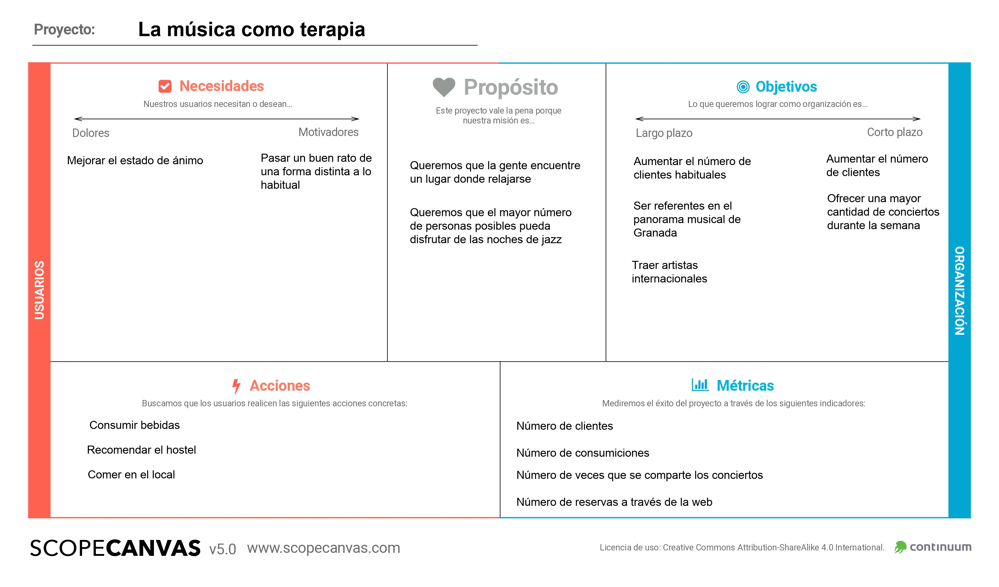
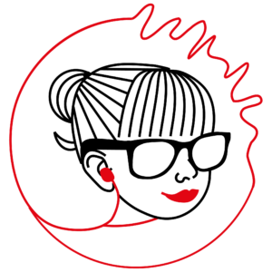
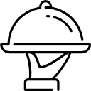

# DIU22
Prácticas Diseño Interfaces de Usuario 2021-22 (Tema: Hostels) 

Grupo:  DIU2.Unknown  Curso: 2021/22 
Updated: 11/2/2022

Proyecto: 
**La música como terapia**

Descripción: 

La idea de nuestro microsite es potenciar la música en directo que se ofrece en el hostal, proponiendo un lugar en el que la música sirva como desconexión a los problemas del día a día. Esto servirá para captar la atención de los amantes de la música y de los artistas que se quieran dar a conocer.

Logotipo: 

Miembros
 * :bust_in_silhouette:  Jesús López Pujazón     :octocat:     
 * :bust_in_silhouette:  Lucía Salamanca López     :octocat:

----- 

# Proceso de Diseño 

## Paso 1. UX Desk Research & Analisis 

 1.a Competitive Analysis
-----

| **Característica**| **Carlota Braun** | **TocHostels** | **CasaBarceló**|
| --- | --- | --- | --- | 
| **Selección de idioma**| Dispone de una opción para traducir mediante el traductor de google (en ocasiones dando lugar a traducciones más inexactas). |Ofrece una opción para cambiar de idioma a inglés y coreano. | Únicamente está disponible en español e inglés.|
| **Localización**| Al acceder al apartado _Donde estamos_ aparecen lugares próximos pero no la localización exacta, teniendo que bajar hasta el final de la página para verla. |No hay un apartado de localización, aunque si descendemos en la página principal encontramos todas las ubicaciones exactas.|Al acceder al apartado _Ubicación_ encontramos la dirección exacta del establecimiento y direcciones para llegar.|
| **Página principal**| El diseño de la página principal es atractivo pero poco legible debido al poco contraste entre la tipografía y la imagen del fondo. |La página principal es elegante y minimalista ofreciendo la información más relevante al bajar por la página.|El diseño es menos atractivo que el de las otras dos páginas ofreciendo menos información que en los casos previos.|
| **Diseño de la interfaz**| Atractiva, sin embargo, tiene varios errores como el comentado anteriormente y faltas de ortografía. | Interfaz atractiva y muy intuitiva.|Poco atractiva y a veces resulta poco intuitiva debido a las posiciones donde se encuentran distintas funcionalidades.|
| **Información acerca de las instalaciones**| Ofrece un resumen de los servicios que disponen y fotografías de las habitaciones. |Ofrece fotografías y un resumen detallado de todos los servicios que ofrecen.|Sólo ofrece una galería de fotografías pero no señala los distintos servicios de los que dispone el hotel y, en concreto, las habitaciones.|

 1.b Persona
-----

Hemos elegido dos personas que pueden ser clientes potenciales de un hostel. Una de ellas con más experiencia en el uso de la tecnología y otra con menos experiencia. 

 1.c User Journey Map
----

Pensamos que estas dos experiencias de usuarios pueden ser las habituales conforme a la personalidad dotada en la creación de ambas personas.

 1.d Usability Review
----

Tanto el xls como el pdf se encuentran en la carpeta P1.

La valoración final es de 61. Los usuarios son capaces de navegar por la página y realizar las tareas que necesiten. Sin embargo, la interfaz puede ser mejorada en muchos aspectos para que la experiencia de usuario sea más satisfactoria.

## Paso 2. UX Design  

 2.a Feedback Capture Grid / Empathy map / POV
----

#### Mapa de empatía 

| Interesante | Críticas | 
| ------------- | -------
|  Diseño de la págia atractivo | Es difícil encontrar el apartado de conciertos |
| | Es difícil encontrar la localización |
  
  
Nuestra propuesta de valor está enfocada en la música en directo que ofrece el hostel, buscando así que sea reconocido por sus conciertos y no sólo por el alojamiento. De este modo organizaremos y estructuraremos mejor todo lo relacionado con los conciertos para poder acceder fácilmente a la información y poder realizar reservas de mesas de manera más sencilla. 

Hemos decidido esta propuesta de valor ya que consideramos que no se aprovecha el potencial de los conciertos para atraer a nuevos clientes. Además, queremos atraer a clientes jóvenes a través del uso de las redes sociales.

 2.b ScopeCanvas
----

 2.b Tasks analysis 
-----

Hemos decidido realizar el User Task Matrix para tener una visión más clara de la importancia de cada una de las funcionalidades para saber cuáles priorizar en la interfaz.
#### User Task Matrix 
| Tareas | **Grupo de amigos** | **Artista** | **Amante de la música**| **Extranjero** |
| --- | --- | --- | --- | --- |
| **Ver carta**| H | L | M | H |
| **Programación conciertos**| M | H | H | L |
| **Reservar mesa**| H | L | M | H |
| **Localización**| H | H | H | H |
| **Contactar con el negocio**| L | H | M | L |

 2.c IA: Sitemap + Labelling 
----

#### Site Map

#### Labelling 

| **Etiqueta** | **Descripción** | **Icono** |
| --- | --- | --- |
| **Inicio**| Página inicial donde se muestra una descripción breve del lugar y los conciertos |  |
| **Conciertos**| Página donde se ofrece información sobre los tipos de conciertos que se pueden encontrar en el hostel. Además se ofrece la posibilidad de compartir la información del concierto a través de las redes sociales.|  |
| **Hoy**| Página donde se ofrece información sobre qué concierto tiene lugar en la fecha actual | |
| **Calendario**| Página donde se ofrece información sobre los conciertos fijados durante ese mes |  |
| **Reservar**| Página con un formulario para realizar la reserva de una mesa | |
| **Carta**| Página donde se muestra el menú que ofrece el restaurante |  |
| **Localización**| Página donde se muestra la ubicación del hostel y cómo llegar hasta él |  |
| **Galería**| Página donde se muestra un conjunto de imágenes del bar donde tienen lugar los conciertos |  |
| **Contacto**| Página con un formulario para contactar con el personal del hostel |  |

 2.d Wireframes
-----

#### Página de Inicio

#### Página de Conciertos

#### Página de Carta

#### Página de Localización

#### Página de Contacto

#### Página de Reserva

## Paso 3. Mi UX-Case Study (diseño)

 3.a Moodboard
-----

[Moodboard en milanote](https://app.milanote.com/1NOqwR1w3mQ5eH?p=uetX8nklt0Q)

#### **Imágenes** 

Las imágenes que nos han inspirado tienen todas un carácter serio y elegante, con unos colores que recuerdan mucho a la noche. El conjunto de estas imágenes sirven como un viaje a otra época lo que las caracteriza también con un toque de nostalgia.

#### **Colores**

Para la paleta de colores hemos decidido escoger cinco colores basados en las imágenes que nos han servido de inspiración. Estos colores son: 
* **Dark Red**: #92140C
* **Smoky Black**: #0F0F0F
* **Satin Sheen Gold**: #C89933
* **White**: #FBFBFB
* **Xanadu**: #77867F

Debido a la elegancia del jazz hemos decidido elegir el blanco, el negro y el gris. Esta elegancia también está presente en las imágenes en blanco y negro de la época.
El rojo representa la pasión intrínseca en la propia esencia de la música en sí y el dorado simboliza los instrumentos de viento metal tan característicos en el jazz.

#### **Tipografías**

Para los títulos o partes en las que tenga que resaltar la tipografía hemos decidido usar [Philosopher](https://fonts.google.com/specimen/Philosopher) y para el cuerpo del texto decidimos usar [Vollkorn](https://fonts.google.com/specimen/Vollkorn). Estas dos tipografías, al igual que en los dos apartados anteriores, se rigen por su elegancia.

#### **Logotipo**

El logotipo tiene un diseño bastante minimalista, haciendo uso de unas pocas líneas rectas y tan sólo un círculo y una curva. Este diseño minimalista hace que consigamos esa elegancia de la que tanto hemos hablado. Como podemos observar representa un cóctel junto con una trompeta, instrumento presente en el jazz. Estos dos elementos muestran la esencia del bar de CarlotaBraun donde la música se mezcla con el bar.

  3.b Landing Page
----

[LandingPage Protopie](https://cloud.protopie.io/p/c3ace80ef5?touchHint=true&ui=true&scaleToFit=true&cursorType=touch&mockup=true&bgColor=%23F5F5F5&playSpeed=1&playerAppPopup=true)

 3.c Guidelines
----

Para las Guidelines hemos seguido patrones que se encuentran en [ui-patterns](https://ui-patterns.com/).

#### **Navegación**

* _El usuario necesita volver a una localización de inicio de la página_: se situará un botón visible permanentemente en todas las páginas con el logo que permita volver a la página inicial. [Patrón inicio](https://ui-patterns.com/patterns/HomeLink)

* _El contenido debe estar separado en secciones y se debe indicar claramente la ubicación actual_: existirá una barra de menú superior con las distintas secciones donde se indique mediante un cambio de color la sección en la que se encuentra el usuario. [Patrón NavigationTabs](https://ui-patterns.com/patterns/NavigationTabs)

#### **Contenido**

* _El usuario necesita introducir rápidamente los datos en el sistema, pero el formato de los datos debe ajustarse a una estructura predefinida_ : para la reserva y el contacto con el lugar se usará un formulario y para la introducción de la fecha de búsqueda de los conciertos se usará un calendario. [Patrón StructuredFormat](https://ui-patterns.com/patterns/StructuredFormat)

* _Los eventos deben presentarse a los usuarios en un modelo visualmente conciso que resuma la fecha y la hora_: para mostrar los conciertos se dispondrá de un calendario con cuatro opciones extra arriba (hoy, mañana, próxima semana), donde el día seleccionado se indicará mediante un cambio en el color. Al lado del calendario se mostrará la información con la fecha y la hora. [Patrón EventCalendar](https://ui-patterns.com/patterns/EventCalendar)

* _El usuario quiere buscar o enviar información en base a una fecha_: tanto para reservar como para la búsqueda de conciertos existe un calendario para buscar una fecha. [Patrón CalendarPicker](https://ui-patterns.com/patterns/CalendarPicker)

* _El usuario quiere compartir fácilmente su actividad en sus redes sociales_: en la parte de los conciertos existirá una opción para compartir en redes sociales mediante botones con los distintos logos de dichas redes. [Patrón Auto-sharing](https://ui-patterns.com/patterns/auto-sharing)

#### **Imágenes**

* El usuario necesita navegar por una colección de imágenes de alta calidad: usaremos una galería de imágenes para la carta y en la localización usaremos un slideshow. [Patrón Galería](https://ui-patterns.com/patterns/Gallery). [Patrón Slideshow](https://ui-patterns.com/patterns/Slideshow)

  3.d Mockup
----

[Mockup en Figma](https://www.figma.com/file/oZ124tV1IzCqz4F6inTQr2/Material-2-Design-Kit-(Community)?node-id=1011%3A3346)

## Paso 4. Evaluación 

 4.a Caso asignado
----

El caso asignado es [Carlota Braun Eventos y Restaurante](https://github.com/Pablo01bm/DIU) realizada por el grupo `DIU2.tarnishedBoys`. Su propuesta consiste en añadir nuevos eventos que tengan lugar en el hostel como el evento _"funny"_ que consistirá en llevar a cómicos de invitados e incitar a la gente a participar tras la velada. También ofrecen una nueva propuesta para el menú del restaurante añadiendo comida vegana y sin gluten.

 4.b User Testing
----

Mediante los dados de usuario obtenemos estos cuatro tipos de usuario:
 

| Usuarios | Sexo/Edad     | Ocupación   |  Exp.TIC    |Dados |  Personalidad | Plataforma | Objetivo | TestA/B
| ------------- | -------- | ----------- | ----------- | -----| -----------  | ---------- | ---- | --- | 
| Inma  | M / 38   | Psicóloga  | Media  | Tipos: 2 (familia) Acción: 4 (calendario) Emoción: 6 (tristeza) | Inma es una mujer familiar, tiene pareja y dos hijos. Es una persona muy cuadriculada que le gusta tener todo ordenado. Inma está triste porque no ha tenido tiempo últimamente para ella y su marido y decide hacer un plan distinto en el Carlota Braun. | Web.       | Encontrar un plan que hacer con su marido | A 
| Martín  | H / 22  | Estudiante  | Alta |  Tipos: 4 (diversidad funcional)  Acción: 2 (idiomas)  Emoción: 5 (asqueado) | Martín no tiene movilidad en el tren inferior. Estudia traducción e interpretación por lo que le gustan los ambientes multiculturales. Lleva un tiempo asqueado porque no encuentra un lugar decente en el que conocer a gente de otros países.  | Web.       | Quiere buscar un plan en el hostel para conocer personas de otros países   | A 
| Roberto | H / 50  | Monitor de yoga | Media-Baja  | Tipos:  1 (meditación)  Acción: 6 (senderismo) Emoción: 4 (sorpresa)  | Roberto es una persona que le gusta mucho la tranquilidad y llevar un estilo de vida saludable. Últimamente se encuentra en una etapa de la vida en la que quiere probar cosas nuevas.  | Móvil      |  Encontrar planes distintos a los que suele hacer   | B 
| Miriam | M / 43  | Ejecutiva  | Alta  |  Tipos: 5 (ejecutiva) Acción: 3 (baile) Emoción: 3 (felicidad)  | Miriam es una mujer de negocios, en su tiempo libre le gusta disfrutar de la música y el baile, alejándose así de su ambiente de trabajo. Últimamente está muy feliz y busca un lugar donde pasar un buen rato.  | Móvil      | Quiere buscar un plan relacionado con la música | B 

. 4.c Cuestionario SUS
----

#### Inma 

| | Preguntas | 1 | 2 | 3 | 4 | 5 
| --- | --- | --- | --- | --- | --- | ---
| 1 | Creo que me gustará visitar con frecuencia este website |  | | **X** | | 
| 2 | Encontré el website innecesariamente complejo | | **X** | | | 
| 3 | Pensé que era fácil utilizar este website | | |  | **X** | 
| 4 | Creo que necesitaría del apoyo de un experto para recorrer el website| **X** | | | | 
| 5 | Encontré las funciones del website bastante bien integradas | | | **X** | | 
| 6 | Pensé que había demasiada inconsistencia en el website | **X** | | | | 
| 7 | Imagino que la mayoría de las personas aprenderían muy rápidamente a utilizar el website | | | | **X** | 
| 8 | Encontré el website muy grande al recorrerlo | | **X** | | | 
| 9 | Me sentí muy confiado en el manejo del website | | | **X** | | 
| 10 | Necesito aprender muchas cosas antes de manejarse en el website| **X** | | | | 

**Puntuación total:** 75

#### Martín

| | Preguntas | 1 | 2 | 3 | 4 | 5 
| --- | --- | --- | --- | --- | --- | --- 
| 1 | Creo que me gustará visitar con frecuencia este website | | | **X** | | 
| 2 | Encontré el website innecesariamente complejo | **X** | | | | 
| 3 | Pensé que era fácil utilizar este website | | | | | **X** 
| 4 | Creo que necesitaría del apoyo de un experto para recorrer el website| **X** | | | | 
| 5 | Encontré las funciones del website bastante bien integradas | |  |  **X** | | 
| 6 | Pensé que había demasiada inconsistencia en el website | | **X** | | | 
| 7 | Imagino que la mayoría de las personas aprenderían muy rápidamente a utilizar el website | | | | **X** | 
| 8 | Encontré el website muy grande al recorrerlo | **X** | | | | 
| 9 | Me sentí muy confiado en el manejo del website | | | | |  **X**
| 10 | Necesito aprender muchas cosas antes de manejarse en el website| **X** | | | | 

**Puntuación total:** 85

####  Roberto

| | Preguntas | 1 | 2 | 3 | 4 | 5 
| --- | --- | --- | --- | --- | --- | ---
| 1 | Creo que me gustará visitar con frecuencia este website | | | | **X** | 
| 2 | Encontré el website innecesariamente complejo | | **X** | | | 
| 3 | Pensé que era fácil utilizar este website | | | **X** | | 
| 4 | Creo que necesitaría del apoyo de un experto para recorrer el website| | **X** | | | 
| 5 | Encontré las funciones del website bastante bien integradas | | | **X** | | 
| 6 | Pensé que había demasiada inconsistencia en el website | | **X**| | | 
| 7 | Imagino que la mayoría de las personas aprenderían muy rápidamente a utilizar el website | | | **X** | | 
| 8 | Encontré el website muy grande al recorrerlo | **X** | | | | 
| 9 | Me sentí muy confiado en el manejo del website | | | **X** | | 
| 10 | Necesito aprender muchas cosas antes de manejarse en el website| **X** | | | | 

**Puntuación total:** 70

#### Miriam

| | Preguntas | 1 | 2 | 3 | 4 | 5 
| --- | --- | --- | --- | --- | --- | ---
| 1 | Creo que me gustará visitar con frecuencia este website | | | | | **X**
| 2 | Encontré el website innecesariamente complejo | **X** | | | | 
| 3 | Pensé que era fácil utilizar este website | | | | **X** | 
| 4 | Creo que necesitaría del apoyo de un experto para recorrer el website| **X** | | | | 
| 5 | Encontré las funciones del website bastante bien integradas | | | **X** | | 
| 6 | Pensé que había demasiada inconsistencia en el website | |**X** | | | 
| 7 | Imagino que la mayoría de las personas aprenderían muy rápidamente a utilizar el website | | | | **X** | 
| 8 | Encontré el website muy grande al recorrerlo | **X** | | | | 
| 9 | Me sentí muy confiado en el manejo del website | | | | | **X**
| 10 | Necesito aprender muchas cosas antes de manejarse en el website| **X** | | | | 

**Puntuación total:** 87.5

Dadas las puntuaciones obtenidas ambas webs, tanto la A como la B, tendrán éxito entre los usuarios con un nivel medio-alto de conocimiento de las TIC. Sin embargo, la opción B parece obtener una puntuación menor en usuarios con un menor nivel de manejo de las tecnologías. Comparando las personas que han realizado la encuesta para la web B podemos comprobar que ambas dan una puntuación menor a la integración de la web y la inconsistencia de ésta, probablemente debido a la opción de restaurante, la cual no permite volver a la página principal.

Podemos considerar que la opción A es más práctica para usuarios con distintos conocimientos de las tic. También tiene menos fallos en cuanto a la navegación, destacando como un error en el B el no poder volver a la pantalla de inicio desde la opción del restaurante. 

 4.d Usability Report
----

>> Añadir report de usabilidad para práctica B (la de los compañeros)

>>> Valoración personal 

>>> ## Paso 5. Evaluación de Accesibilidad  (no necesaria)

>>>   5.a Accesibility evaluation Report 
>>>> ----

>>> Indica qué pretendes evaluar (de accesibilidad) sobre qué APP y qué resultados has obtenido 

>>> 5.a) Evaluación de la Accesibilidad (con simuladores o verificación de WACG) 
>>> 5.b) Uso de simuladores de accesibilidad 

>>> (uso de tabla de datos, indicar herramientas usadas) 

>>> 5.c Breve resumen del estudio de accesibilidad (de práctica 1) y puntos fuertes y de mejora de los criterios de accesibilidad de tu diseño propuesto en Práctica 4.

## Conclusión final / Valoración de las prácticas

>>> (90-150 palabras) Opinión del proceso de desarrollo de diseño siguiendo metodología UX y valoración (positiva /negativa) de los resultados obtenidos  

